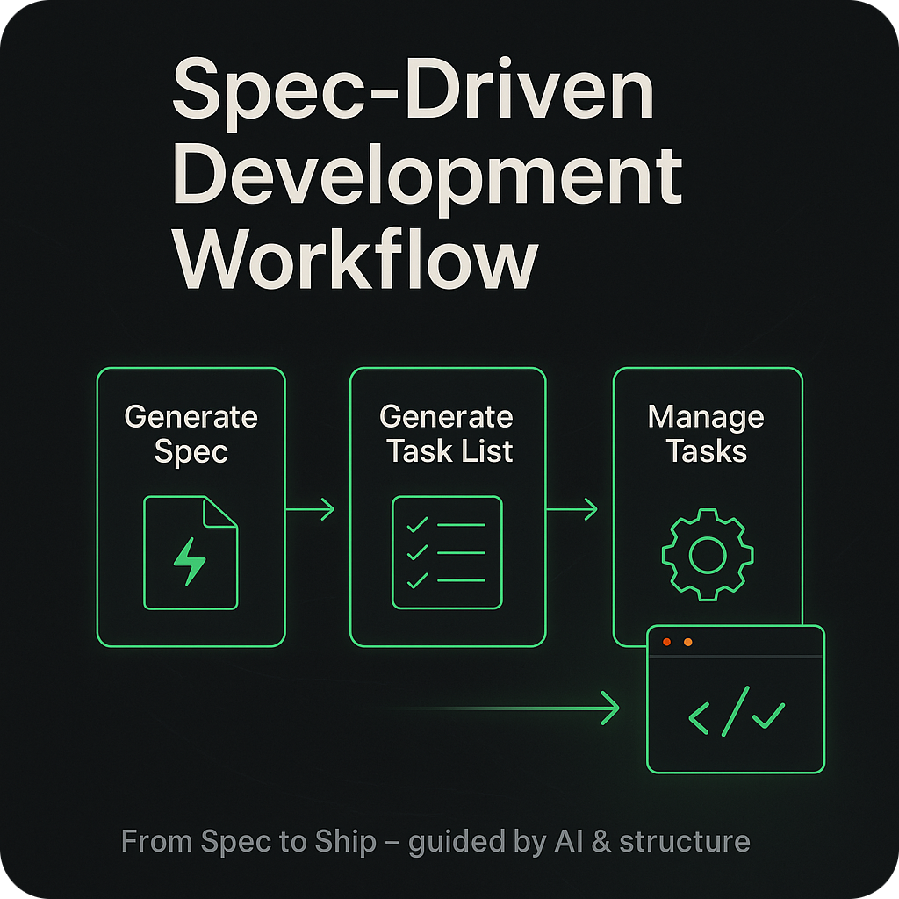

# Movie App Lab 4, Part 2: AI

Redo Lab 4 using AI and spec-driven development.

In the previous lab, you completed the final part of the movie app. In this lab, you will rebuild the same Lab 4 features using a spec-driven workflow.

You will:

- create a new branch from the final Lab 3 commit
- recreate the Lab 4 features using spec-driven development
- use the skills repo as a guide for the AI-generated code

This approach helps the AI produce components that are easier to understand, review, and maintain.

## Before you start

This lab assumes you have already completed Movie App Lab 3. If you completed Lab 4 previously, use the commit that marked the end of Lab 3 as the starting point for this exercise.

## 1. Create a new branch from Lab 3

Open a command line in the movie app repository.

Find the commit you want to branch from. Use the commit message that matches the end of Lab 3, for example:

~~~bash
git log --oneline
~~~

Look for the commit with one of these messages:

- `Refactor to allow for new filtering hook, and add the hook.`
- `Added Upcoming movies page.`

Use the commit hash to create a new branch:

~~~bash
git switch -c movie-app-lab4-ai <commit-hash>
~~~

You can also create the branch using the Source Control view in VS Code if you prefer.

Run the app with `npm run dev` and confirm that it behaves exactly as it did at the end of Lab 3. Once that is working, you are ready to prepare the repo for AI-assisted development.