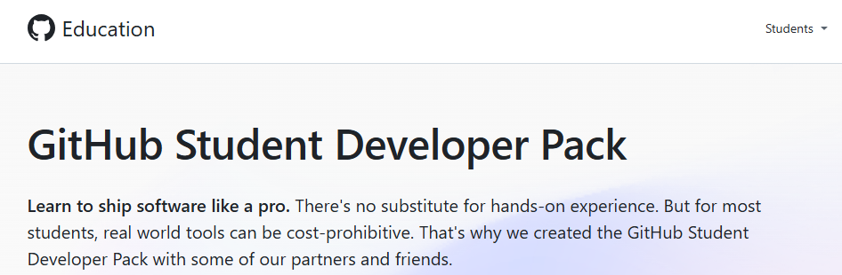
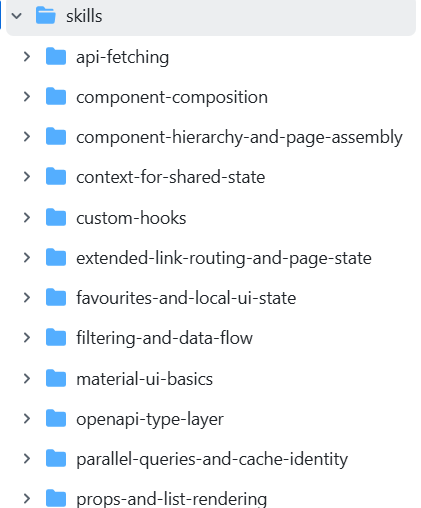

# Lab Setup

This page explains how to prepare your environment for the lab. You will need:

- access to an AI assistant
- the `liatrio-labs/spec-driven-workflow` prompts installed
- a skills repo that you can use and update

## 1. Using an AI Assistant in VS Code

You can use any AI assistant for this lab. It was tested with GitHub Copilot Student, but other assistants can work too if they are available inside VS Code or through the command line.

If you want to use Copilot Free, see [About individual GitHub Copilot plans and benefits](https://docs.github.com/en/copilot/managing-copilot/managing-copilot-as-an-individual-subscriber/about-github-copilot-free).

**Copilot Student:**

As a SETU Student you are eligible to free CoPilot access as part of Github Education Pack  https://education.github.com/pack

NOTE: April 21st update: Just checking and this may have been suspended in the last 

---

### Set up the AI chat assistant in VS Code

1. Open **VS Code**.
2. Open the **Extensions** view.
3. Search for **GitHub Copilot**.
4. Install the official **GitHub Copilot** extension.
5. When prompted, sign in using the **same GitHub account** that has your approved student benefits.

### Test the AI assistant

Open a coding project and try one of these:

- Start typing a function and wait for a suggestion.
- Open Copilot Chat and ask:
  - `Explain this file`

## 2. Spec-Driven Development (SDD) Framework

This lab uses the **liatrio-labs/spec-driven-workflow** prompts inside Visual Studio Code. The workflow provides structured Markdown prompts that guide AI assistants through a complete software development process:

The workflow provides these four main slash commands:

- `/SDD-1-generate-spec` - define intent and generate a reviewed spec with clear demo criteria
- `/SDD-2-generate-task-list-from-spec` - break work into demoable tasks and subtasks, then run a planning audit gate
- `/SDD-3-manage-tasks` - implement with checkpoints and proof artifacts
- `/SDD-4-validate-spec-implementation` - verify implementation against the spec with evidence

This lab covers the first three steps in that workflow.

These commands are distributed as Markdown prompt files. In VS Code, prompt files can be invoked directly from AI chat as slash commands.

To install the required slash commands, go to the [liatrio-labs/spec-driven-workflow repo](https://github.com/liatrio-labs/spec-driven-workflow) and follow the instructions for your machine.

Once installed:

1. Open **VS Code**.
2. Open the folder for your project.
3. Open **AI Chat** in VS Code.
4. Type `/` in the chat box.
5. Look for the above installed SDD commands.

## 3. React Skills Repo

Over the past few weeks in this module, you have developed a range of skills in React and TypeScript through lectures and labs. The next step is to consolidate that knowledge by creating a **skills repository**. This repository should describe the key concepts, techniques, and programming patterns you have learned, such as component composition, hooks, routing, and data-fetching patterns. It acts as a structured reference for your own understanding and as a guide for AI-assisted development.

You can download a pre-built repository from [this link](https://github.com/fxwalsh/skills-repo-up-to-movie-lab-4-full). Ideally, you would create your own from scratch, but to save time in this lab you may use the provided version as a starting point. It was generated from an LLM-friendly version of the module and is also available from the module website menu.

You are encouraged to:

- modify and extend the repository
- add additional React skills or patterns you are familiar with
- refine descriptions in your own words

The goal is for the repository to reflect **your understanding and capabilities**. It should contain skills that you can confidently explain, apply, and use to evaluate or guide AI-generated code.

- Clone https://github.com/fxwalsh/skills-repo-up-to-movie-lab-4-full onto your machine.
- Read the README and look through the contents of the `skills` folder.
  

Each subfolder contains a `skills.md` file with a description and reference code. Each skill is written so an AI agent can recognise when the skill is relevant and produce understandable code that you can support and explain.
