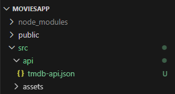
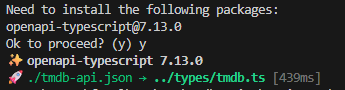

## Developing the Home Page components.

The image below shows a possible component breakdown of the app's Home page:

![][homecomponents]

[ NOTE: We will ignore the navigation bar at the top for now.]

The components suggested from this breakdown are:

1. Movie Card.
1. Movie List.
1. Movie List Header.
1. Filtering movies card.

[The Filtering movies card component will display as a side sheet when the user clicks the Filtering button. This dynamic behaviour is covered in a later lab.

![][filtersheet]


### TMDB API: OpenAPI Description

As stated previously, we will use the TMDB API OpenAPI description as the single source of truth for the data model. 

Go to the [tmdb-api.json](https://developer.themoviedb.org/openapi/tmdb-api.json ) and save into /src/api as `tmdb-api.json`.

Your file structure should now look like this:


Open a command line in the api folder and generate the ts types for the movie app using:

~~~bash
npx openapi-typescript ./tmdb-api.json -o ../types/generated/tmdb.ts 
~~~

You should see output similar to the following


This will generate interfaces and types that describe the shape of every endpoint and type used in the API. It is a very extensive and rich API so, although we generate everything once, we can just pick the types we are using in our app. 

There are  **three main sections** in the tmdb.ts file :

```
export interface paths { ... }
export interface components { ... }
export interface operations { ... } // sometimes
```

The type descriptions we need are buries inside the paths we will use in the API. We can create your own types "layer" that extract the descriptions from the path responses.

In `/src/types`, create a new file called `movieAppTypes.ts`:

~~~typescript
// src/types/tmdb.ts

import { paths } from "./generated/tmdb";

// Type for the API response when discovering movies
export type DiscoverMoviesProps = paths["/3/discover/movie"]["get"]["responses"][200]["content"]["application/json"];

// Type for a single movie object from the discover movies response
export type DiscoverMovieOverviewProps =  NonNullable<DiscoverMoviesProps["results"]>[number];

// Props interface for components that display a list of movies
export type BaseMovieListProps  ={
  movies: NonNullable<DiscoverMoviesProps["results"]>;
}

// Type for the API response when fetching detailed movie information
export type MovieDetailsProps = paths["/3/movie/{movie_id}"]["get"]["responses"][200]["content"]["application/json"];

~~~

`NonNullable` is there to remove any `null` or `undefined` from the generated API type before you use it. Some  OpenAPI fields are likely optional, So this will  strip out null and undefined and treat it as a definite array. This is the what you’ll use in your app to describe the shape of interfaces/types. We will add to this as we go along...


React Components:

### The MovieCard component.

In VS Code, create the filer `src/components/MovieCard.tsx` :

~~~tsx
import Card from "@mui/material/Card";
import CardActions from "@mui/material/CardActions";
import CardContent from "@mui/material/CardContent";
import CardMedia from "@mui/material/CardMedia";
import CardHeader from "@mui/material/CardHeader";
import Button from "@mui/material/Button";
import Typography from "@mui/material/Typography";
import FavoriteIcon from "@mui/icons-material/Favorite";
import CalendarIcon from "@mui/icons-material/CalendarTodayTwoTone";
import StarRateIcon from "@mui/icons-material/StarRate";
import Grid from "@mui/material/Grid";
import IconButton from "@mui/material/IconButton";
import img from '../images/film-poster-placeholder.png';
import { DiscoverMovieOverviewProps } from "../types/movieAppTypes";

const styles = {
  card: { maxWidth: 345 },
  media: { height: 500 },
  avatar: {
    backgroundColor: "rgb(255, 0, 0)",
  },
};

const MovieCard = (movie: DiscoverMovieOverviewProps) => {
 

  return (
    <Card sx={styles.card}>
      <CardHeader title={movie.title ?? "Untitled"} />
      <CardMedia
        sx={styles.media}
        image={
          movie.poster_path
            ? `https://image.tmdb.org/t/p/w500/${movie.poster_path}`
            : img
        }
      />
      <CardContent>
        <Grid container>
          <Grid item xs={6}>
            <Typography variant="h6" component="p">
              <CalendarIcon fontSize="small" />
              {movie.release_date}
            </Typography>
          </Grid>
          <Grid item xs={6}>
            <Typography variant="h6" component="p">
              <StarRateIcon fontSize="small" />
              {"  "} {movie.vote_average}{" "}
            </Typography>
          </Grid>
        </Grid>
      </CardContent>
      <CardActions disableSpacing>
        <IconButton aria-label="add to favorites" >
          <FavoriteIcon color="primary" fontSize="large" />
        </IconButton>
        <Button variant="outlined" size="medium" color="primary">
          More Info ...
        </Button>
      </CardActions>
    </Card>
  );
}

export default MovieCard;
~~~
Note, the `More Info ...' button and the Favourite icon are inactive - we are only developing a static web app at this stage.

Some comments on the code above:

+ A Material UI Card component is used to contain the information - see [here](https://material-ui.com/components/cards/).
+ For some movies, TMDB does not have a related poster. We display a placeholder in those cases. 
+ In the card's content section, we use the Material's Grid component to structure the information - see [here](https://material-ui.com/components/grid/). We want the content to be horizontally aligned. 
+ The Typography component controls how text is displayed and represented in the DOM - see [here](https://material-ui.com/components/typography/). In this example, the text will show as an h6 header, and its DOM representation will be a paragraph (p).
+ The MovieCard component expects a BaseMovie type as a prop - we saw an example of a Movie's data structure in an earlier section of this lab.


### The Filtering Card component.

In VS Code, create the file `src/components/filterMoviesCard.tsx` with the following:
~~~tsx
import Card from "@mui/material/Card";
import CardContent from "@mui/material/CardContent";
import Typography from "@mui/material/Typography";
import InputLabel from "@mui/material/InputLabel";
import MenuItem from "@mui/material/MenuItem";
import TextField from "@mui/material/TextField";
import FilterAltIcon from '@mui/icons-material/FilterAlt';
import SortIcon from '@mui/icons-material/Sort';
import FormControl from "@mui/material/FormControl";
import Select from "@mui/material/Select";

const styles = {
  root: {
    maxWidth: 345,
  },
  media: { height: 300 },
 
  formControl: {
    margin: 1,
    minWidth: 220,
    backgroundColor: "rgb(255, 255, 255)",
  },
};


  const FilterMoviesCard = () => {

  const genres = [
    {id: 1, name: "Animation"},
    {id: 2, name: "Comedy"},
    {id: 3, name: "Thriller"}
  ]

  return (
    <>
    <Card sx={styles.root} variant="outlined">
      <CardContent>
        <Typography variant="h5" component="h1">
          <FilterAltIcon fontSize="large" />
          Filter the movies.
        </Typography>
        <TextField
          sx={styles.formControl}
          id="filled-search"
          label="Search field"
          type="search"
          variant="filled"
        />
        <FormControl sx={styles.formControl}>
          <InputLabel id="genre-label">Genre</InputLabel>
          <Select
            labelId="genre-label"
            id="genre-select"
          >
            {genres.map((genre) => {
              return (
                <MenuItem key={genre.id} value={genre.id}>
                  {genre.name}
                </MenuItem>
              );
            })}
          </Select>
        </FormControl>
      </CardContent>
    </Card>
    <Card sx={styles.root} variant="outlined">
        <CardContent>
          <Typography variant="h5" component="h1">
            <SortIcon fontSize="large" />
            Sort the movies.
          </Typography>
        </CardContent>
      </Card>
      </>
  );
}

export default FilterMoviesCard;
~~~
The genre list is hard-coded for now, but we will dynamically construct it in a future lab. Notice how the genre dropdown list is generated at runtime using array mapping.

### The Header component.

In VS Code, create the file `src/components/HeaderMovieList` :
~~~tsx
import ArrowBackIcon from "@mui/icons-material/ArrowBack";
import ArrowForwardIcon from "@mui/icons-material/ArrowForward";
import Paper from "@mui/material/Paper";
import IconButton from "@mui/material/IconButton";
import Typography from "@mui/material/Typography";

const styles = {
    root: {
        display: "flex",
        justifyContent: "space-around",
        alignItems: "center",
        flexWrap: "wrap",
        marginBottom: 1.5,
    },
};

interface HeaderProps {
    title: string;
}

const Header = (headerProps: HeaderProps) => {
    const title = headerProps.title

    return (
        <Paper component="div" sx={styles.root}>
            <IconButton
                aria-label="go back"
            >
                <ArrowBackIcon color="primary" fontSize="large" />
            </IconButton>

            <Typography variant="h4" component="h3">
                {title}
            </Typography>
            <IconButton
                aria-label="go forward"
            >
                <ArrowForwardIcon color="primary" fontSize="large" />
            </IconButton>
        </Paper>
    );
};

export default Header;
~~~
The backward/forward arrows do not work yet. The Material Paper component is a generic wrapper component (see [here](https://material-ui.com/components/paper/)).

Before continuing, from the integrated terminal panel, update the git repository as follows:
~~~
$ git add -A
$ git commit -m "Home page components."
$ git push origin main
~~~

[homecomponents]: ./img/homecomponents.png
[filtersheet]: ./img/filtersheet.png
[cardstory]: ./img/cardstory.png
[filterstory]: ./img/filterstory.png
