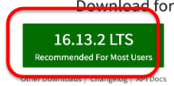

# API Labs Repo

You already are using Git/Github for your work with React. You will now create a new repo for your Web API work

### Create a Remote Repository

- Go to github.com, log in, and click the '+' in the top right to create a new repository.
  Give it a name ***ewd-api-labs-2022**, and a short description.
  Select the following options:
  - make it public or private as you see fit.

  - Create a ***readme.md*.**
  - create a ***.gitignore*** and select the ***Node*** option in the dropdown.

Click create repository and you should be taken to your new repo page. 

- Copy the repo URL from the "Code" option on the repo page.  You will need the URL of the repo to clone this repo to your local machine.

### Clone your Remote to your Local Machine

- On your local machine, find a suitable folder and clone your remote repo

~~~bash
$ git clone <YOUR_URL_FROM_GITHUB>
~~~

We will now set up and configure a development environment for Node.js. The following labs were developed using the following node version:

You will already have node on your machine and should work with node versions 10 and greater. If it was installed at the commencement of this module then it should suffice.

**Make sure you have a ``.gitignore`` file that ignores node-based things that you don't want to track, such as ``.env``, ``node-modules``.**

- Open a terminal command line in the root folder and enter the following command:

~~~bash
npm init
~~~

- You will be prompted for details. Enter the following:

~~~
name: (ewd-labs-2022) ewd-labs-2022
version: (1.0.0) 
description: ewd labs 2022
entry point: (index.js)
test command:
git repository: 
keywords:
author: YOUR_GIT_USERNAME
license: (ISC)
~~~

You should now see a ``package.json`` file in the lab directory with these details.
If you're developing a Node program or library for deployment, it's standard practice to include a **package.json** file. This file is the **manifest of the Node project** and is located at your project root. It contains various information specific to your project such as module dependencies and scripts. 

## Babel

Similar to your work with the React labs, **we will be writing our Javascript using ES6+** so we require ***transcoding*** to a backward compatible version before our Node app runs. We need to bring in some babel packages to handle this.

- Enter the following command to get the relevant babel package and relevant  presets.

~~~bash
npm install --save-dev babel-cli
npm install --save-dev babel-preset-env
~~~

The ``--save-dev`` will write this dependency to the development section of the package.json. Have a look at the *package.json* file and you will now see the dev dependency on babel as highlighted below:

- To configure babel to transcode from ES6+, create a file called **.babelrc** in the **root** folder and enter in the following:

~~~json
{
  "presets": ["env"]
}
~~~

## Nodemon

When we change things in a Node.js project, a restart is required for the changes to be reflected in the running process. This can be very time consuming. Instead of manually restarting Node, we will install the ``nodemon`` package as a **development dependency**, which can monitor our files and auto-restart Node for us when we save changes to disk.

- Install Nodemon:

~~~bash
npm install --save-dev nodemon
~~~

## Commit it

Now that we have a our basic setup and configuration complete,this is a good time to commit your changes to git.

- In the directory *ewd-node_labs_2022* run the following:

~~~bash
git add --all
git commit -m "set up and initial configuration"
~~~

You should **NOT** see any output indicating changes ignored file and folders, for example the *node_modules* folder. We do not need to track changes here as it's contents are specified in the *package.json*.
