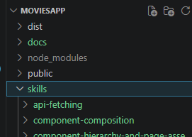
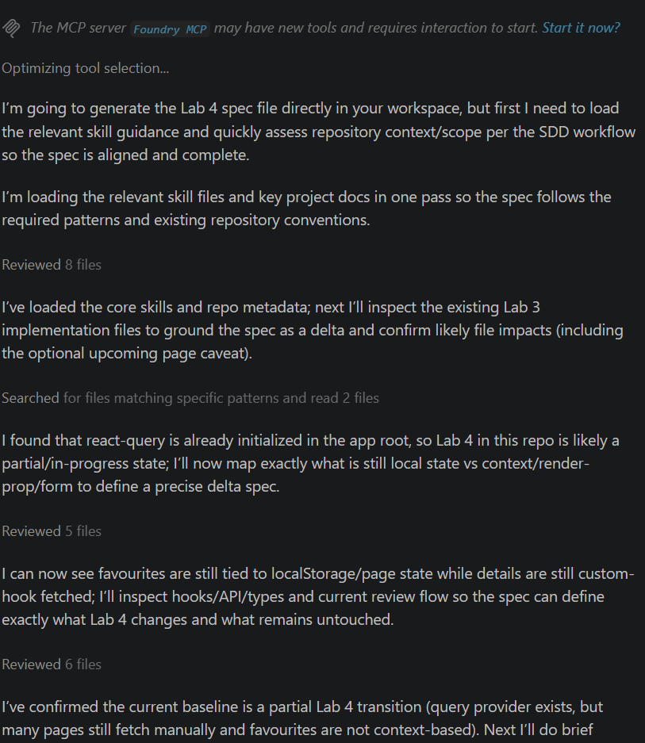

# Using SDD - Generating a Spec

You will now develop Movies App Lab 4 using the spec-driven development approach.

The first step is to generate a specification. The goal of a spec is to turn a vague feature request into a clear, shared contract before implementation starts. The spec should describe:

what is changing  
what is staying the same  
what is in scope and out of scope  
what behaviours must be true when the work is done  
what files or areas are likely to change  
how success will be validated

+ Copy only the `skills` folder from the skills repo you cloned in the previous step and paste it into the root of the Movies-App-Lab-3 solution (that is the new branch you just created in the previous step). The AI will use this as a reference.

You can now prompt the AI to generate a specification for Movies App Lab 4 using the SDD workflow prompts installed in the previous step. The important part is to make the prompt specific enough for the framework to generate an accurate spec. Include points such as:

- Treat the current codebase as the starting point of the implementation.
- Do not rebuild the whole application from scratch.
- Describe only the new behaviour, refactors, and files likely to change for Lab 4.
- Reuse existing code and patterns already present in the repo.
- The skills to be used in the implementation are contained in the `skills` folder.

Ideally you construct this yourself for the features that you want to specify. However, here is an example you can use.

- In VS Code, copy the following into your AI chat:

~~~text
/SDD-1-generate-spec  
Create a feature spec for Lab 4 of the existing movie app in this repository.

Context:

- This repo already contains the completed Lab 3 solution.
- Treat the current codebase as the baseline implementation.
- Do not restate the whole application from scratch.
- Describe only the new behaviour, refactors, and files likely to change for Lab 4.

Baseline already includes:

- Vite + React + TypeScript
- TMDB API integration
- movie list page
- movie details page
- routing for home, favourites, movie details, and full review pages
- filtering on movie lists
- favourites support
- a central API layer or equivalent fetch helpers
- reusable list-page patterns already introduced in earlier labs
- reusable movie-page template using component composition
- critic review excerpts and full review page
- custom hook support already introduced in Lab 3
- improved site-wide header/navigation from Lab 3

Lab 4 feature goals:

1. Server state fetching should be refactored to use browser-side caching with react-query so repeated page visits do not trigger unnecessary API requests.

2. Shared app-wide favourites state should be moved to React Context so favourite selections persist across page navigation without relying on local page state.

3. The favourites page should load favourite movie details using the shared context and appropriate data-fetching patterns.

4. Movie card action buttons should become configurable so different pages can render different actions without duplicating the movie card component.

5. The configurable card actions should support at least:
   - add to favourites on the discover/home page
   - remove from favourites on the favourites page
   - write review action on the favourites page

6. A review form page should be added so the user can write a review for a favourite movie.

7. The review form should use a form-handling library pattern and include validation, submission handling, and clear user feedback.

8. User-submitted reviews should be stored in app state using the current lab’s chosen temporary approach.

9. Existing Lab 3 behaviour should continue to work unless explicitly changed by this Lab 4 feature.

10. If the codebase already contains an upcoming movies page from the Lab 3 exercise, the spec should note that this feature may be temporarily broken by the Lab 4 refactor and should not be treated as core in-scope unless explicitly included as follow-up work.

Expected implementation direction:

- Reuse existing code and patterns already present in the repo where possible.
- Prefer extending the current structure rather than rewriting it.
- Keep components small and understandable.
- Use react-query for server state instead of manual useEffect/useState fetching where this Lab introduces caching.
- Use React Context for shared favourites state.
- Use render-prop style composition for configurable movie card actions.
- Use the existing API layer pattern instead of embedding fetch logic directly in page components.
- Use conditional rendering for async data so pages do not crash before API data is available.
- Keep the implementation incremental and aligned with the existing Lab 3 structure.

Skills that must guide the solution:

- skills/server-state-caching/SKILL.md
- skills/context-for-shared-state/SKILL.md
- skills/render-props-configurable-actions/SKILL.md
- skills/review-forms-with-react-hook-form/SKILL.md
- skills/api-fetching/SKILL.md
- skills/component-composition/SKILL.md
- skills/component-hierarchy-and-page-assembly/SKILL.md

Instructions for the spec:

- Include a clear “Starting Point” section that says the feature starts from the completed Lab 3 solution in this repo.
- Include a “Relevant Skills” section listing the exact skill files above.
- Include “In Scope” and “Out of Scope” sections.
- Include “Expected Functional Behaviour” with separate subsections for:

- server-state caching

- favourites context

- favourites page

- configurable movie card actions

- review form page

- review submission flow

- Include “Non-Functional Requirements”.
- Include “Likely Files To Add” and “Likely Files To Modify”.
- Include “Acceptance Criteria”.
- Include “Evidence Required” for validation.
- Make the spec detailed enough that a later task-generation step can map each major task back to the spec.
- Ensure the spec is written as a delta from Lab 3, not as a full restatement of the app.

Likely new files may include:

- src/contexts/MoviesContext.tsx
- src/components/CardIcons/AddToFavourites.tsx
- src/components/CardIcons/RemoveFromFavourites.tsx
- src/components/CardIcons/WriteReview.tsx
- src/components/ReviewForm/...
- src/pages/AddMovieReviewPage.tsx

Likely modified files may include:

- src/index.tsx
- src/pages/HomePage.tsx
- src/pages/FavouriteMoviesPage.tsx
- src/pages/MovieDetailsPage.tsx
- src/components/MovieCard/...
- src/components/MovieList/...
- src/components/TemplateMovieListPage/...
- src/components/FilterMoviesCard/...
- src/api/tmdb-api.ts
- src/types/movieAppTypes.ts
- src/hooks/useMovie.ts

Output file:

specs/lab4-caching-context-reviews/spec.md
~~~

When you run this, the AI chat may request permission to access web resources (Tan Stack etc) - you can approve these.  You will see output similar to the following:

It will take some time to generate the `specs/lab4-caching-context-reviews/spec.md` file. Examine this file and check that it is accurate. You can edit it if you notice any errors or omissions. It will be different for everybody but should be a thorough specification of the features.

This will be used to generate a detailed implementation plan in the next step.

