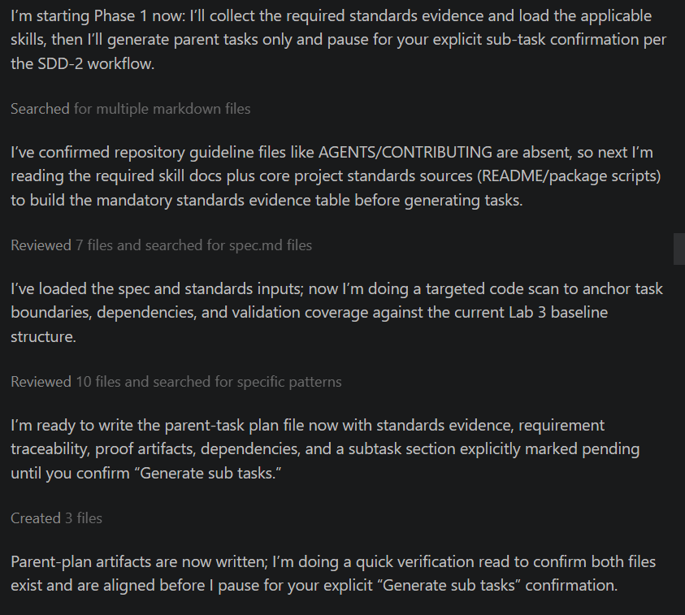

# Using SDD - Generating a Task List

Once you are happy with the spec document (`specs/lab4-caching-context-reviews/spec.md`), the next step is to create a task list. The `/SDD-2-generate-task-list-from-spec` command to turns the spec into a step-by-step task list that can guide the AI in performing the  development, testing, and commits to the repo. It helps ensure the work is broken into sensible pieces before implementation starts. 
**It converts the spec into parent tasks that are meant to be independent  units of work, plus detailed subtasks underneath them. It also creates a baseline planning commit, runs a planning audit gate, and expects any audit issues to be fixed before you move on to implementation. This will generate a `tasks` markdown file for the features and an `audit` markdown file that records planning quality checks.  
Again you can develop/generate you own plan but here is a sample one you c

+ In the AI chat, enter the following command:
  ~~~text
  /SDD-2-generate-task-list-from-spec
  
  Generate a task list from the Lab 4 movie app feature spec in this repository.
  
  Primary input:
  
  - specs/lab4-caching-context-reviews/spec.md
  
  Starting point:
  
  - Assume the current codebase is the completed Lab 3 solution.
  - Treat the spec as the source of truth for planning.
  - Generate tasks only for the Lab 4 delta described in the spec.
  - Do not restate or re-plan the entire application.
  
  Purpose:
  
  Convert the Lab 4 spec into:
  - parent tasks that represent meaningful, demoable units of work
  - detailed subtasks that are small enough to implement safely and review clearly
  - a planning output that supports later execution and validation
  
  Planning constraints:
  
  - Reuse the existing project structure and patterns where possible.
  - Prefer incremental change over large rewrites.
  - Keep existing Lab 3 behaviour working unless the spec explicitly changes it.
  - Reflect the architecture choices required by the spec:
    - react-query for server-state caching
    - React Context for shared favourites state
    - render-prop style configurable movie card actions
    - react-hook-form for review form handling
    - reuse of the existing API layer
    - conditional rendering for async data
    - reuse of existing page-template patterns where appropriate
  
  Task-generation requirements:
  
  Create parent tasks and subtasks for the following work areas:
  
  1. Introduce react-query provider setup and cache configuration
  2. Refactor API-driven pages/components to use react-query where required by Lab 4
  3. Add shared favourites state using React Context
  4. Refactor home and favourites flows to consume shared favourites state
  5. Refactor movie card actions to become configurable
  6. Add page-specific card action components
  7. Add the review form page and route
  8. Implement review form validation, submission, and feedback flow
  9. Add temporary app-state storage for submitted reviews
  10. Verify that existing Lab 3 features still work after the Lab 4 refactor
  11. Update or repair stories/tests only if required by the spec or impacted by the refactor
  
  Task design rules:
  
  - Parent tasks must be demoable units.
  - Subtasks must be implementation-ready and concrete.
  - Order tasks so foundations come first and dependent work follows.
  - Avoid mixing unrelated concerns in one parent task.
  - Include validation subtasks inside or alongside the relevant parent tasks.
  - Include explicit validation coverage for:
    - discover/home page
    - movie details page
    - review excerpts drawer
    - full review page
    - favourites page
    - review form page
    - caching behaviour
    - configurable movie card actions
  
  For each parent task include:
  
  - task id
  - title
  - goal
  - spec sections covered
  - demoable outcome
  - likely files affected
  
  For each subtask include:
  
  - subtask id
  - parent task id
  - clear implementation action
  - relevant files
  - completion signal / done condition
  
  Skills that must guide the breakdown:
  
  - skills/server-state-caching/SKILL.md
  - skills/context-for-shared-state/SKILL.md
  - skills/render-props-configurable-actions/SKILL.md
  - skills/review-forms-with-react-hook-form/SKILL.md
  - skills/api-fetching/SKILL.md
  - skills/component-composition/SKILL.md
  - skills/component-hierarchy-and-page-assembly/SKILL.md
  
  Expected output structure:
  
  1. Feature Reference
  2. Planning Assumptions
  3. Parent Tasks
  4. Detailed Subtasks
  5. Task Dependencies
  6. Planning Audit Considerations
  7. Validation Coverage Map
  
  Instructions:
  
  - Make the task list detailed enough for later execution with /SDD-3-manage-tasks.
  - Keep the plan tightly aligned to the spec.
  - Do not write implementation code.
  - Do not invent new major features outside the spec.
  - Call out any areas where the spec may require careful sequencing or audit attention.
  - Ensure every major acceptance criterion in the spec is traceable to at least one parent task and one or more subtasks.
  
  Output files:
  
  - specs/lab4-caching-context-reviews/tasks.md
  - specs/lab4-caching-context-reviews/audit.md
  ~~~

This can take some time to complete. The more specific the prompt you give the AI, the more precise the result will be. Once this is complete, you can move on to the manage-tasks stage and implement each task with AI. 

This is an example of the output you may see as the AI processes the spec. 

You can review the generated `tasks.md` and `audit.md` files when the script finishes. 