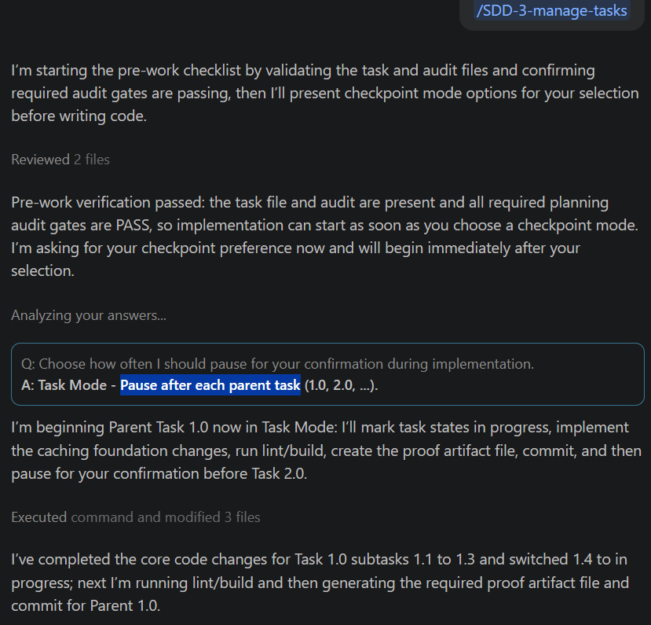

# Using SDD - Managing Tasks

The `/SDD-3-manage-tasks` command is used to implement the task list step by step. This is where code is generated.

After generating your tasks in Step 2, `/SDD-3-manage-tasks` guides the development process by:

- [ ] Selecting the next task to work on
- [ ] Generating the required code changes
- [ ] Ensuring each task is completed before moving on

Each task should represent a small, tesable piece of functionality. As you work through the tasks, you should:

1. Review and understand the code being generated
2. Test that the feature works as expected

The focus of this step is controlled, incremental development. Instead of building everything at once, you complete one task at a time so the application remains stable and working.

+ In the AI chat, enter the following:

~~~text 
/SDD-3-manage-tasks Pause after each parent task
~~~

You may be prompted about how you wish to progress though the tasks by the AI. This may take some time and you will be asked to all uptdtes and git commits after each task in complete. The AI will pause after each task and you can have a look at te code and test the functionality implemented in the task. 

### Reflection:

Check that all the functionality has been completed by doing a manual test for each task.

Ask yourself:

- How does it compare to the original lab?
- Did the new artifacts conform to the skills specified in the skills repo?
- Are there any bugs?

You can use the AI assistant to fix bugs and request that any changes are updated in the spec document.