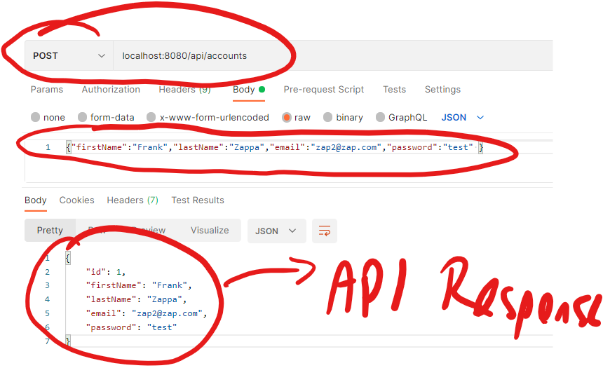

# User Accounts

We will continue to develop an API for the MovieDB you completed in the last lab.

In our API, we will manage user accounts and use  account details to control access to the movie endpoints. 
The first part of the lab will create the following endpoints to achieve this:

+ In the *src* folder from the previous lab, create a folder called ***accounts*** that contains the following sub folders:

## Account Entity

+ In */src/accounts/entities* create a new script called ***Accounts.js*** with the following content:
  ~~~javascript
  export default class {
      constructor(id = undefined, firstName, lastName, email, password) {
        this.id = id;
        this.firstName = firstName;
        this.lastName = lastName;
        this.email = email;
        this.password = password;
      }
    }
  
  ~~~

The Entities folder contains the business entities used in the App. In this case it is the  Account class.  Notice there is no dependencies on other modules or frameoworks.

## Accounts Repository

+ In *src/accounts/repositories*, create a new file called ***Repository.js*** with the following content

  ~~~javascript
  export default  class {
  
    persist(account) {
      throw new Error('ERR_METHOD_NOT_IMPLEMENTED');
    }
  
    merge(account) {
      throw new Error('ERR_METHOD_NOT_IMPLEMENTED');
    }
  
    remove(accountId) {
      throw new Error('ERR_METHOD_NOT_IMPLEMENTED');
    }
  
    get(accountId) {
      throw new Error('ERR_METHOD_NOT_IMPLEMENTED');
    }
  
    getByEmail(email) {
      throw new Error('ERR_METHOD_NOT_IMPLEMENTED');
    }
  
    find(query) {
      throw new Error('ERR_METHOD_NOT_IMPLEMENTED');
    }
  
  }
  ~~~

  The Repository class provides a "contract" or interface description of how our Accounts repository will work. Essentially it discibes how we will access data for out API. It is independent of any DB implementation details. We can now provide a "concrete" implementation by extending this class 

### Repository implementation

In the absence of a "real" database, we will provide a an in-memory  implementation of the Accounts repositor (we will replace this with MongoDB implementation next week).

+ In *src/accounts/repositories*, create a new folder called ***in-memory***. Create a new file called AccountsRepository.js with the following content:

  ~~~javascript
  import AccountRepository from '../Repository';
  
  export default class extends AccountRepository {
  
    dataAsArray() {
      return Object.keys(this.data).map(key => this.data[key]);
    }
  
    constructor() {
      super();
      this.index = 1;
      this.data = {};
    }
  
    persist(accountEntity) {
      const row = Object.assign({}, accountEntity);
      const rowId = this.index++;
      row.id = rowId;
      this.data[rowId] = row;
      return row;
    }
  
    merge(accountEntity) {
      let row = this.data[accountEntity.id];
      Object.assign(row, accountEntity);
      return Promise.resolve(row);
    }
  
    remove(userId) {
      delete this.data[userId];
      return Promise.resolve();
    }
  
    get(userId) {
      return Promise.resolve(this.data[userId]);
    }
  
    getByEmail(userEmail) {
      const users = this._dataAsArray();
      return Promise.resolve(users.find(user => user.email === userEmail));
    }
  
    find() {
      return Promise.resolve(this.dataAsArray());
    }
  
  }
  ~~~

  This class provides implementations of the methods in Repository.js. It uses an in-memory javascript object to store account details. 

## Accounts Service

+ In */src/accounts/services*, create a new file called ***index.js*** with the following content:

  ~~~javascript
  import Account from '../entities/Account';
  
  export default {
    registerAccount: async  (firstName, lastName, email, password, {accountsRepository}) => {
      const account = new Account(undefined, firstName, lastName, email, password);
      return accountsRepository.persist(account);
    },
    getAccount: (accountId, {accountsRepository}) => {
      return accountsRepository.get(accountId);
    },
    find: ({accountsRepository})=>{
      return accountsRepository.find();
    },
    findByEmail: (email, {accountsRepository})=>{
      return accountsRepository.getByEmail(email);
    }
  };
  ~~~

The accounts service contains the use case scenarios that we need to manage user accounts, like "Register and Account" or "Find an account using email".
It also interacts with the accounts Repository. Notice that the *accountsRepository* is passed in to each "use case" as part of the function arguments. It is **not** an imported module. This is **dependency injection**, whereby the service itself has no direct dependencies to a particular Repository implementation.

## Accounts Controller

+ In */src/accounts/controller*, create a new file called ***index.js*** with the following content:

~~~javascript
import accountService from "../services";

export default (dependencies) => {

    const createAccount = async (request, response, next) => {
        // Input
        const { firstName, lastName, email, password } = request.body;
        // Treatment
        const account = await accountService.registerAccount(firstName, lastName, email, password, dependencies);
        //const output = dependencies.accountsSerializer.serialize(account);
        //output
        response.status(201).json(account)
    };
    const getAccount = async (request, response, next) => {
        //input
        const accountId = request.params.id;
        // Treatment
        const account = await accountService.getAccount(accountId, dependencies);
        // const output = dependencies.accountsSerializer.serialize(account);
        //output
        response.status(200).json(account);
    };
    const listAccounts = async (request, response, next) => {
        // Treatment
        const accounts = await accountService.find(dependencies);
        //output
        response.status(200).json(accounts);
    };
   

    return {
        createAccount,
        getAccount,
        listAccounts
    };
};
~~~

The controller orchestrates input and output to and from  the API. Notice that is calls the accounts service which contain more "pure" business logic. Controllers handle the HTTP request and calling services . Controllers  orchestrate the service calls and decide what to do with the data returned.

You might wonder why we don't access the Accounts Repository  directly from the controller, since all it seems to do is pass the request to the service and return the response. While our app is simple at the moment,  in that all it does is access the database through our Repository, as we develop further it may get more complex.

## Express Router

+ In */src/accounts/routes*, create a new file called ***index.js*** with the following content:

  ~~~javascript
  import express from 'express';
  import AccountsController from '../controllers';
  
  const createRouter = (dependencies) => {
      const router = express.Router();
      // load controller with dependencies
      const accountsController = AccountsController(dependencies);
      router.route('/')
          .post(accountsController.createAccount);
  
          router.route('/')
          .get(accountsController.listAccounts);
  
      router.route('/:id')
          .get(accountsController.getAccount);
      
      router.route('/:id')
          .post(accountsController.getAccount);
      
      return router;
  };
  export default createRouter;
  ~~~

Very little logic should go in your routers. They should only connect our controller functions in the express middleware (for now,  we only have one per end point). As we go futher, we can add more controllers, for example, that handles authentication, and have routes that need authentication.

Also, notice this is the first time we've imported Express. Everything up to now is independent of the Express framework and could be used in another framwork is we wish.

## Config and Dependencies

+ Add the following entry to ***.env*** file(in the root folder):
  ~~~javascript
  DATABASE_DIALECT=in-memory
  ~~~

  We use this entry to indicate which database "dialect" we wish to use. Currently we don't have a real DB so we'll use in-memory db implementation 
  
+ In the ***src*** folder of the project (the folder that contains the accounts and movies folder), create a new folder called ***config***. Create a file called ***dependencies.js*** and add the following content:
  
  ~~~javascript
  import AccountsRepositoryInMemory from '../accounts/repositories/in-memory/AccountRepository';
  
  const buildDependencies = () => {
    const dependencies = {
    };
  
    if (process.env.DATABASE_DIALECT === "in-memory") {
      dependencies.accountsRepository = new AccountsRepositoryInMemory();
    } else if (process.env.DATABASE_DIALECT === "mongo") {
      throw new Error('Add Mongo Support');
    } else if (process.env.DATABASE_DIALECT === "mysql") {
      throw new Error('Add MySQL support');
    } else {
      throw new Error('Add DB Support to project');
    }
    return dependencies;
  };
  
  export default buildDependencies;
  ~~~
  

This module exports the `buildDependencies()` function. We will import this when the API starts and use it to  "inject" infrastucure dependencies(such as Repositories) into the routes/services.

## Update /index.js

We now need to update the API entry point, *index.js*, to apply the Accounts router to the '/api/accounts' path. We also need to include the dependencies

+ Open ***index.js*** on the root folder of the project and add the following :

  ~~~javascript
  import createAccountsRouter from './src/accounts/routes';
  import dependencies from "./src/config/dependencies";
  ~~~

+ Add the following route to the Express app. 

  ~~~javascript
  
  app.use('/api/accounts', createAccountsRouter(dependencies()));
  ~~~

  

## Test It!

Using Postman, test the routes you've just implemented

+ Post some account data to the API as shown below. 

+ Once you've added some Account data, do a **GET /api/accounts** and **GET /api/accounts/:id** to see if it worked!

## Commit your changes

- Commit the changes you have just made using git.

~~~bash
git add -A
git commit -m "Added Accounts Endpoints"
~~~
