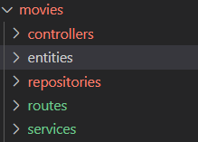

# Movies 

Lets now refactor the movies endpoints so that they conform to the structure we've applied to the users. We also want to integrate to the TMDB api to provide main source of movie data. For this we will use [axios](https://axios-http.com/), a HTTP client module.  

## Update .env 

You will need to include the TMDB api key you used in rpevious labs. 

+ Add your ket to  your ***.env*** file as follows:

~~~javascript
TMDB_KEY=YOUR_TBDM_KEY
~~~

+ Import axios as a dev dependency:
  ~~~
  npm install -dev axios
  ~~~

## Folder structure

+ Inside the folder ***src/movies***, create a similar folder structure to the Accounts.
   
  
  We won't use all of these folders yet. 
  
+ In the ***src/services*** folder, create a file called ***index.js*** add the following code:

~~~javascript
import axios from 'axios';

export default {
    getMovie: async (movieId) => {
        const response = await axios.get(
            `https://api.themoviedb.org/3/movie/${movieId}?api_key=${process.env.TMDB_KEY}`
          );
          return response.data;
    },
    find: async (query) => {
        const response = await axios.get(
            `https://api.themoviedb.org/3/discover/movie?api_key=${process.env.TMDB_KEY}&language=en-US&include_adult=false&include_video=false&${query}`
          );
          return response.data;
    },

  };
~~~

+ In the ***src/controllers*** folder, create a file called ***index.js*** add the following code:

  ~~~javascript
  import moviesService from "./../services";
  
  export default (dependencies) => {
  
      const getMovie = async (request, response, next) => {
          //input
          const movieId = request.params.id;
          // Treatment
          const movie = await moviesService.getMovie(movieId, dependencies);
          //output
          response.status(200).json(movie);
      };
      const find = async (request, response, next) => {
          //input
          const query = request.query;
          // Treatment
          const accounts = await moviesService.find(query, dependencies);
          //output
          response.status(200).json(accounts);
      };
  
      return {
          getMovie,
          find
      };
  };
  ~~~

+ In the routes folder, create a file called ***index.js*** add the following code:

  ~~~javascript
  import express from 'express';
  import MoviesController from '../controllers';
  
  const createMoviesRouter = (dependencies) => {
      const router = express.Router();
      // load controllers with dependencies
      const moviesController = MoviesController(dependencies);
  
      router.route('/:id')
          .get(moviesController.getMovie);
  
      router.route('/')
          .get(moviesController.find);
  
      return router;
  };
  export default createMoviesRouter;
  ~~~

## Update index.js

Now we need to change the routing for the 'api/movies' path in the app entry script.

+ Open ***index.js*** in the root folder and add the following to import the new movies router:

  ~~~java
  import createMoviesRouter from './src/movies/routes';
  ~~~

+ You can remove the previous import statement for the movies router from last week.

+ Update the existing line of code that adds the movies router to the following:

  ~~~javascript
  app.use('/api/movies', createMoviesRouter(dependencies));
  ~~~

## Test It!

+ As with the Accounts endpoints, test that your implementation was worked.

## Commit your changes

- Commit the changes you have just made using git.

~~~bash
git add -A
git commit -m "Updated Movies Endpoints"
~~~
