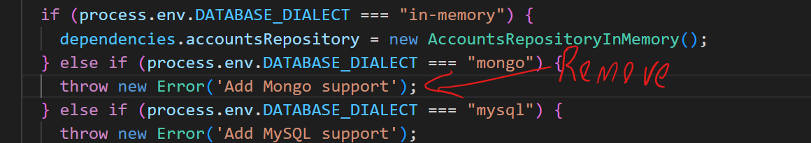

# Connect DB: Mongoose 

Install Mongoose in your lab project folder for the Express app.

~~~bash
npm install -save mongoose
~~~

## Connect the Database

You should only need to connect to the Mongo database once, when your Express application starts.

- Add the **mongoDb URL** to the end of your ``.env`` file in the root folder of the express app. If you set it up on your local machine with default settings,  it will be the following:  

```bash
DATABASE_URL=mongodb://localhost:27017/movies_db
```

+ In the same file, update the database dialect to `mongo`

  ~~~
  DATABASE_DIALECT=mongo
  ~~~


+ Remove the Raise Error lins of code in the dependencies.js script




+ In the ***/src/config*** folder of the app,  create a file called  ***db.js*** with the following contents:

```javascript
import dotenv from 'dotenv';
import mongoose from 'mongoose';

dotenv.config();

export default {

    async init() {
        if (process.env.DATABASE_DIALECT === "mongo") {
            // Connect to database
            mongoose.connect(process.env.DATABASE_URL);
            const connection = await mongoose.connection;

            connection.on('error', (err) => {
                console.log(`database connection error: ${err}`);
            });
            connection.on('disconnected', () => {
                console.log('database disconnected');
            });
            connection.once('open', async () => {
                console.log(`database connected to ${connection.name} on ${connection.host}`);
                //delete the existing  collections if in development mode
                if (process.env.NODE_ENV == "development") {

                    // Get all collections
                    const collections = await connection.db.listCollections().toArray();

                    //delete all collections
                    collections
                        .map((collection) => collection.name)
                        .forEach(async (collectionName) => {
                            connection.dropCollection(collectionName);
                        });
                }
            });
        }

    }
};
```

Have a look at the event callbacks in the above code. In the database "open" event, we check if the node environment is in development mode (``if (process.env.NODE_ENV=="development")``)  and drop the accounts collection. This is to allow us to test the app and not build up a lot of test data.

+ Now add the following lines to the import statements at the top of the entry point, index.js,  script in  the root folder.

~~~javascript
import db from './src/config/db';
....other code

db.init(); //add BELOW dotenv.config();
~~~

This will automatically trigger the connection to the database when the app starts up. If you start the app, you should see the connection details on the console output:


## Account Repository using Mongo as the DB

We will need a collection to store account details for our Movie app. Having account details will allow us to create authentication functionality and support things like movie reviews and favourites which are associated with a user/account. 

We need to create a Repository class that declares the mongoose object structure (or schema) for the Accounts collection in the database. 


+ In ***src/accounts/repositories***, add a new script called ***MongoAccountRepository.js*** in *src/accounts/repositories* with the following content:
  ~~~javascript
  import Account from '../../entities/Account';
  import mongoose from 'mongoose';
  import AccountRepository from './Repository';
  
  export default class extends AccountRepository {
  
      constructor() {
          super();
          const accountsSchema = new mongoose.Schema({
              firstName: String,
              lastName: String,
              email: {type: String, unique: true, index: true},
              password: String,
              favourites: [Number]
          });
          this.model = mongoose.model('Account', accountsSchema);
      }
  
      async persist(accountEntity) {
          const {firstName, lastName, email, password} = accountEntity;
          const result = new this.model({firstName, lastName, email, password});
          await result.save();
          accountEntity.id=result.id;
          return accountEntity;
      }
  
      async merge(accountEntity) {
          const {id, firstName, lastName, email, password, favourites } = accountEntity;
          await this.model.findByIdAndUpdate(id, { firstName, lastName, email, password, favourites });
          console.log({id, firstName, lastName, email, password, favourites });
          return accountEntity;
      }
  
      async remove(userId) {
          return this.model.findOneAndDelete(userId);
      }
  
      async get(userId) {
          const result = await this.model.findById(userId);
          const {id, firstName, lastName, email, password, favourites } = result;
          return new Account(id, firstName, lastName, email, password, favourites );
      }
  
      async getByEmail(userEmail) {
          const result = await this.model.findOne({email: userEmail});
          return new Account(result.id, result.firstName, result.lastName, result.email, result.password,result.favourites);
      }
  
      async find() {
          const accounts = await this.model.find();
          return accounts.map((result) => {
              return new Account(result.id, result.firstName, result.lastName, result.email, result.password, result.favourites);
          });
      }
  }
  ~~~
  
  Just like the ***in-memory***  repository you created in the previous lab, the above class extends the Repository class and provides implementations of each method. The class constructor created a Mongoose model that is then used to  create, update, and query the Accounts collection in the DB. For example, in the  ``get(accountId)`` method, the statement ``const mongooseAccount = await this.model.findById(userId);`` uses the model to find an account using the account id.
  
+ We need to include the Mongo Repository in the dependencies. Open ***src/config/depenencies.js*** . Find the ***if*** statement where it checks if the Database Dialect is "mongo" and update as follows: 
  ~~~javascript
  import AccountsRepositoryMongo from '../accounts/repositories/mongo/AccountRepository';
  
  	....
  
  } else if (process.env.DATABASE_DIALECT === "mongo") {
      dependencies.accountsRepository = new AccountsRepositoryMongo();
  } else if {
      ....
  
  ~~~
  
  This constructs the Mongo Accounts repository and assigns it to the accounts repository.

## Test It!

Now test that the DB is connected by posting a few account details using the API. 


## Commit it

Commit your work to your git repository.


