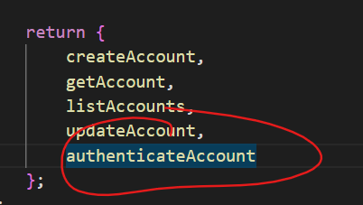
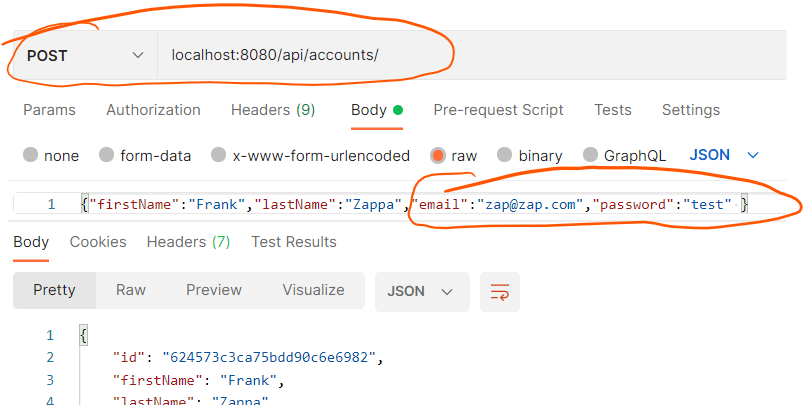
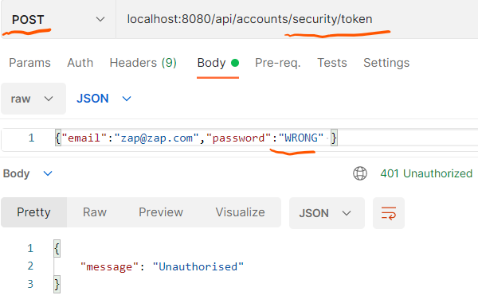

# Basic Security/Authentication

 One of the main goals for the Accounts API is to support authentication. We need to create an endpoint whereby user accounts can be authenticated using an email and password. To do this, we will create a new endpoint on our service, ***POST /api/accounts/security/token***. This will accept a user email and password from the request and return a token if a match is found. If not, it will return an authentication failed response (with a HTTP status code 401).

+ In the ***/src/accounts*** folder, create a new folder called ***security***. In this folder, create a new file called Authenticator.js

  ~~~javascript
  export default class {
    // Encrypt clear case password
    encrypt(password) {
      throw new Error('ERR_METHOD_NOT_IMPLEMENTED');
    }
    //compare an encrypted password to a clear case password 
    compare(password, encryptedPassword) {
      throw new Error('ERR_METHOD_NOT_IMPLEMENTED');
    }
  }
  ~~~

  This class describes the methods used to both encrypt and compare passwords for our app. It acts as a ***"contract"*** that we must implement to provide API security(i.e. encryption and authentication).

+ In /***src/accounts/security***, create a new folder called ***simple***. In this folder, create a new file called ***index.js*** with the following content

  ~~~javascript
  import Authenticator from '../Authenticator';
  // A simple/nieve Authentication service. WILL BE UPDATED TO USE ENCRYPTION LATER
  export default class extends Authenticator {
    async compare(password, encryptedPassword) {
      try {
        // Compare password
        const result = password == encryptedPassword;
        return Promise.resolve(result);
      } catch (error) {
        return Promise.resolve(false);
      }
    }
  }
  ~~~

The accounts folder should now look as follows:

+ Include the above Authentication Service as an API dependency. Open ***/src/config/dependencies.js*** and add the Authentication Service

  ~~~javascript
  ...
  import Authenticator from './accounts/security/simple';
  ...
  const buildDependencies = () => {
    const dependencies = {
      validators: AccountValidators,
      authenticator: new Authenticator()
    };
  ~~~

  

## Authentication Service

+ Open ***/src/accounts/services/index.js*** and add the following function to provide authentication service:
  ~~~javascript
    authenticate: async (email, password, {accountsRepository, authenticator}) => {
      const account = await accountsRepository.getByEmail(email);
      const result = await authenticator.compare(password, account.password);
      if (!result) {
          throw new Error('Bad credentials');
      }
      const token = JSON.stringify({ email: account.email });//JUST Temporary!!! TODO: make it better
      return token;
  }
  ~~~

  Notice that we are using 2 injected dependencies here, the accounts repository and authenticator. The function uses the accounts repository to retrieve the account , `await accountsRepository.getByEmail(email))` , and then compares the stored password to the one provided, `await authenticator.compare(password, account.password);`.

  For now, we just return a stringified version of the email. In the future, we will generate a unique token for the account. 

## Authentication Controller

+ Open ***src/accounts/controller/index.js*** and add the following:

  ~~~javascript
     const authenticateAccount = async (request, response, next) => {
          try {
              const { email, password } = request.body;
              const token = await accountService.authenticate(email, password, dependencies);
              response.status(200).json({ token: `BEARER ${token}` });
          } catch (error) {
              response.status(401).json({ message: 'Unauthorised' });
          }
      };
  ~~~

+ Now add the function to the return statement at the end of the script

  

  

  This controller extracts the email and password form the request and uses them to call the authenticate method in the account Service. It then constructs the correct response based on the result. 

  ## Accounts Router

+ Open ***/src/accounts/routes*** and update index.js as follows:

~~~javascript
...
router.route('/security/token')
        .post(accountsController.authenticateAccount);
...
~~~

This sets up the routing for the *POST /api/accounts/security/token* endpoint. 

## Test It!

Now test that it works by first adding an account:

Then Authenticating using **valid credentials**:

And finally with **invalid credentials**:

~~~javascript
~~~

