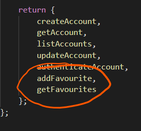
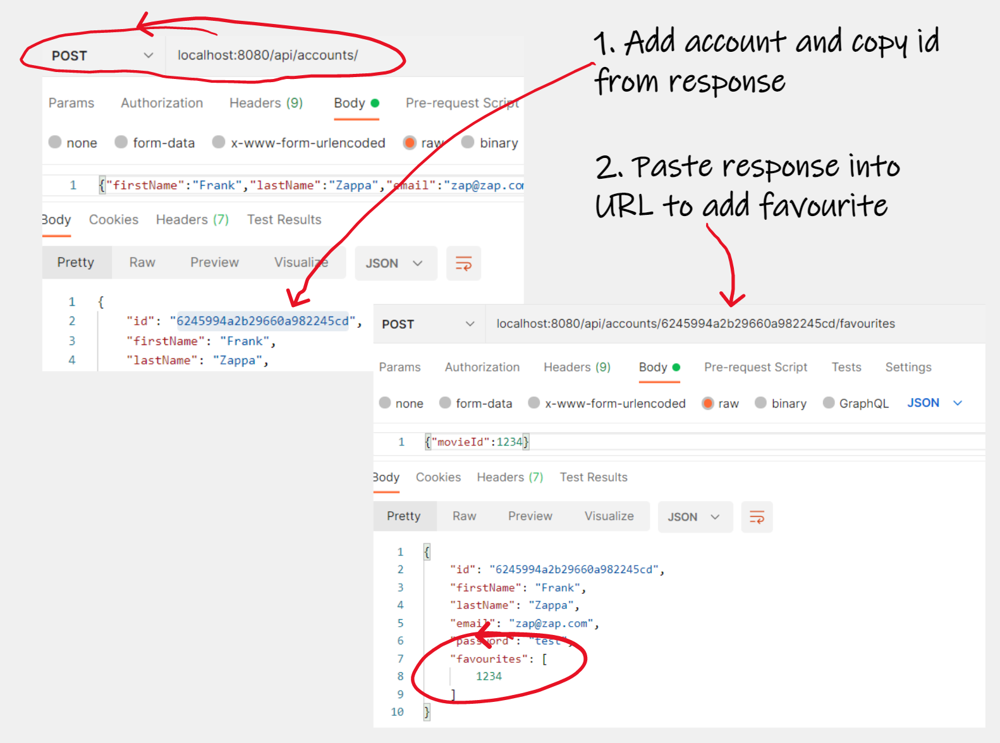
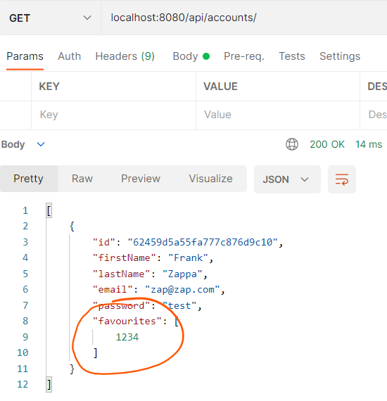

## Movie Favourites

We already have the Movie routes defined for */api/movies/*. This can be imported into the User API code to create the route for  */api/accounts/{accountid}/favourites path*. We can then populate a favourites list in the Account that contains references to Movies. 

### Update Account Schema

- Update/check that the schema description in  *\src\accounts\repositories\mongo\AccountRepository.js* includes an array of favourites.

  

## Update Services

- Update ***/src/accounts/services/index.js*** to include the following:

  ~~~javascript
  /// ... Code as Before
  
    getFavourites: async (accountId, { accountsRepository }) => {
      const account = await accountsRepository.get(accountId);
      return account.favourites;
    },
    addFavourite: async (accountId, movieId, { accountsRepository }) => {
      const account = await accountsRepository.get(accountId);
      account.favourites.push(movieId);
      return await accountsRepository.merge(account);
      
    }
    
   /// ... Code as Before
  ~~~

Here we implement 2 "scenarios" for managing favourites - Adding and updating a favourite. This is quite simple- you will have the opportunity to improve this in the exercises

## Accounts Controller

+ Update ***/src/accounts/controllers/index.js*** to include the following additional controllers:

  

~~~javascript
//... Code as before

	const addFavourite = async (request, response, next) => {
        try {
            const { movieId } = request.body;
            const id = request.params.id;
            const account = await accountService.addFavourite(id, movieId, dependencies);
            response.status(200).json(account);
        } catch (err) {
            next(new Error(`Invalid Data ${err.message}`));
        }
    };
    const getFavourites = async (request, response, next) => {
        try {
            const id = request.params.id;
            const favourites = await accountService.getFavourites(id, dependencies);
            response.status(200).json(favourites);
        } catch (err) {
            next(new Error(`Invalid Data ${err.message}`));
        }
    };

// ..code as before

~~~

+ In the same script, Add the new controllers to the return statement:

## Accounts Router

- Open ***/src/accounts/routes/index.js*** and add the following POST /:id/favourites and GET /:id/favourites Route code.

~~~javascript
/// ... Code as Before

    router.route('/:id/favourites')
        .post(accountsController.addFavourite);
    router.route('/:id/favourites')
        .get(accountsController.getFavourites);

/// ... Code as Before
~~~

## Test Movie Favourites

- Now test the  favourites routes by adding a favourite movie to an account. You'll need to get a valid movie ID and account ID. For the account ID, first create an account and then copy the id returned.
   For a valid Movie ID,  do a GET on */api/movies/, copy the _id of a  movie returned, and paste into the body of the POST */api/accounts/accountid/favourites* as follows:  

Notice that the only the Favourite Movie ID is stored in the favourites array 

+ Now Do a GET /api/movies/accountid/favourites. You'll notice that the Movie ref is present.

## Commit it

Commit your work to your git repository.