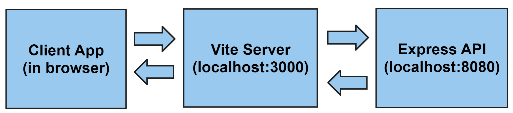
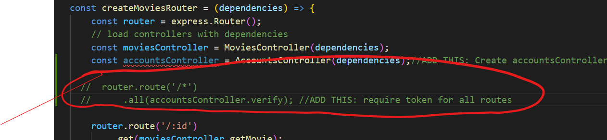

# React - API Integration

You will use a simple React App and integrate it with the API. You can get this application from the Resources archive in this topic on the website.

This React App is taken from the code samples from the  **React Design, Routing, and Performance** React topic(week7). 

## Initial set up

+ Download the React App archive from the Resources link on the website.
+ Extract the archive to a location on your local machine.  DO NOT EXTRACT THIS INTO THE SRC FOLDER FOR YOUR OTHER LABS.
+ Open the .env file in the base folder and add your TMDB key:
~~~
VITE_TMDB_KEY=c18YOUR_KEY bcb
~~~
+ Open a terminal Window in the *reactApp* folder and run ``npm install`` followed by ``npm run dev``. This should start the React app and you should see the App appear in the browser  
  

In this application, no routes are protected. 

+ Click on the *movies* link you'll see movie detials. 

Look at the code and notice that there is a *pages* folder  that exports most of the  pages for the app.

We will now connect theReact App to the movie API. 

## System Architecture

The **Vite** provides a mechanism for working with an API server in development. We can make the development server proxy requests intended for our API server as follows:



The React app makes an API request to localhost:3000, the **Vite** development server. The development server then proxies that request to the API server. This will remove any Cross-Origin-Resource-Sharing (CORS) issues with the browser.
You will now configure react dev server to proxy requests to the Express API.

#### Proxy Server
To have the React development server proxy our API requests to our Express API server, we need to add the following to the **vite.config.js file in the React Application**

+ In the *caching* folder,  add the following to the ***server*** property just before the closing brace (``}``): 

```json
    proxy: {
      '/api': {
        target: 'http://127.0.0.1:8080',
        changeOrigin: true,
        secure: false
      }
```

The contents of the file should look like this:


Make sure the format of the *file* is correct/valid before you try to start the app.

This should now forward any request with ""/api/*" to the Express API listening on port 8080.

The React App should restart as usual. 

## Integrating the Express Movie API

Currently the simple React app uses TMDB API retrieve movies. You will now add the functionality that integrates the express API.  Initially we'll do it without authentication

+ **IN YOUR EXPRESS APP** comment out the code in the Movies router that does JWT authentication. Open /src/movies/routes/index.js and comment out the lines indicated below. 

 

This is just temporary to allow the react app to retrieve movies.

+ **IN YOUR REACT APP**, open /src/api.js and the getMovie function to request the movies using the path /api/movies. 

  ~~~javascript
  //...
  export const getMovies = () => {
    return fetch(
      `/api/movies`
    ).then((res) => res.json());
  };
  //...
  ~~~


The React App should reload and show the movies as before. The difference now is that the request is being proxied though the Express API. 

+ **IN YOUR REACT APP**, repeat the same process for getMovie function and replace the tmdb URL with the path to the movie details :

  ~~~javascript
  export const getMovie = (args) => {
    const [, idPart] = args.queryKey;
    const { id } = idPart;
    return fetch(
      `/api/movie/${id}`
    ).then((res) => res.json());
  };
  ~~~


You also need to manage JWT tokens in local storage in the browser.

Initially, we will integrate the authentication functionality.

+ Go to the */src * folder and create a new folder called *api*
+ In  */src/api.js*, create a new file called *movie-api.js* with the following code:

```javascript
export const signup = (email, password, firstName, lastName) => {
    return fetch('/api/accounts', {
        headers: {
            'Content-Type': 'application/json'
        },
        method: 'post',
        body: JSON.stringify({ email: email, password: password, firstName: firstName, lastName: lastName })
    }).then(res => res.json())
};

export const login = (email, password) => {
    return fetch('/api/accounts/security/token', {
        headers: {
            'Content-Type': 'application/json'
        },
        method: 'post',
        body: JSON.stringify({ email: email, password: password })
    }).then(res => res.json())
};

```

Notice how the routes match what is implemented in the Express API **and** what you tested using postman. The proxy configuration in Vite provides the host information required to complete the request(i.e. 127.0.0.1:8080). 

## Commit it!
Commit your changes
~~~bash
git add -A
git commit -m "React App API Integration"
~~~