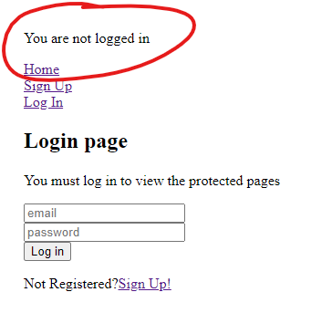
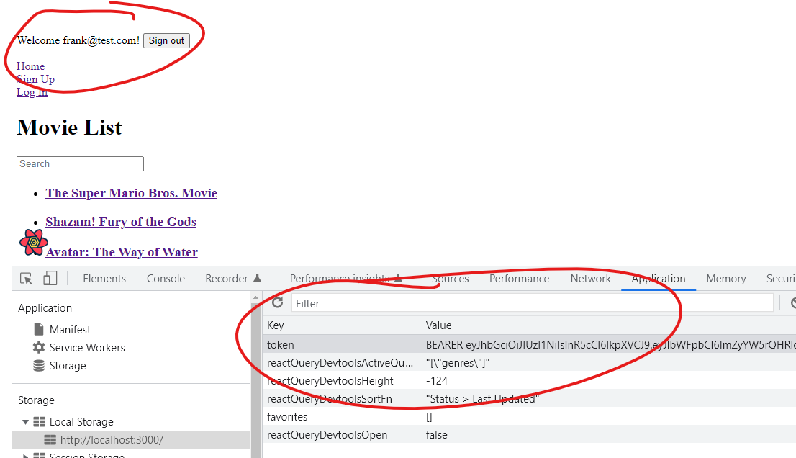
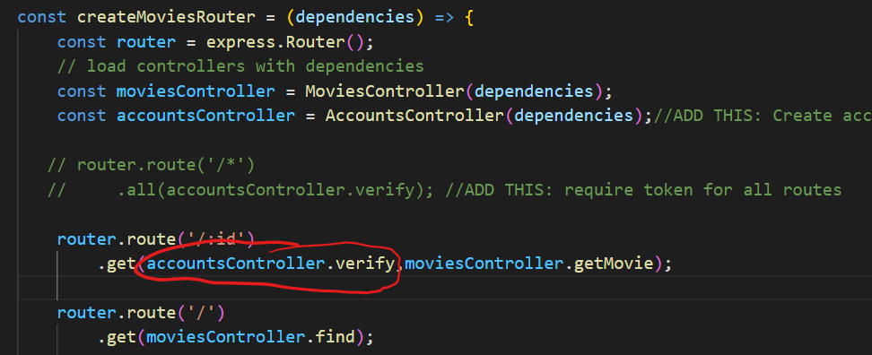

# React - Authentication Context

Your API uses JSON Web Tokens(JWT) to authenticate. We now need to create an *authContext.js* to store and use JWT tokens.

### Add Token to API Request

We are now storing JWT token in local storage in the browser. It needs to be included at least on all routes that are protected(or youi could add it to all requests to the API if you wish). We will just add the authorisation header to the getMovie Details request

+ IN THE REACT APP, open /src/api.jsx and replace the getMovie function with the following: 

~~~javascript
export const getMovie = (args) => {
  const [, idPart] = args.queryKey;
  const { id } = idPart;
  return fetch(
    `/api/movie/${id}`,{headers: {
      'Authorization': window.localStorage.getItem('token')
   }}
  ).then((res) => res.json());
};
~~~

Notice that it is the same as before, except this time we're adding an authorisation header to the HTTP request that contains the JWT token. We get the JWT token from local storage. 
Also notice that this essentially the same as what we did with Postman, except we're now doing it programmatically in our app.

## Login Page
You will now update the basic React login page to use the authentication Context in the React App.

+ In */src/pages* folder, locate the file *loginPage.jsx* and replace with the following:

~~~javascript
import React, { useContext, useState } from "react";
import { Navigate } from "react-router-dom";
import { AuthContext } from '../contexts/authContext';
import { Link } from "react-router-dom";

const LoginPage = props => {
  const context = useContext(AuthContext)
  const [email, setEmail] = useState("");
  const [password, setPassword] = useState("");

  const login = () => {
    context.authenticate(email, password);
  };

  // Set 'from' to path where browser is redirected after a successful login.
  // Either / or the protected path user tried to access.
 // const { from } = props.location.state || { from: { pathname: "/" } };

  if (context.isAuthenticated === true) {
    return <Navigate to={"./home"} />;
  }
  return (
    <>
      <h2>Login page</h2>
      <p>You must log in to view the protected pages </p>
      <input id="email" placeholder="email" onChange={e => {
        setEmail(e.target.value);
      }}></input><br />
      <input id="password" type="password" placeholder="password" onChange={e => {
        setPassword(e.target.value);
      }}></input><br />
      {/* Login web form  */}
      <button onClick={login}>Log in</button>
      <p>Not Registered?
      <Link to="/signup">Sign Up!</Link></p>
    </>
  );
};

export default LoginPage;
~~~
This page provides the input fields for user name and password and uses the auth context to authenticate the user. 

+ Open index.jsx and add the Route element for the  loigin page. Follow the same procedure for the sign in page)

  ~~~javascript
  import loginPage from "./pages/loginPage";      
   
  ....
  
  <Route path="/login" element={<loginPage />} />
      
  .....
  ~~~

  

+ In */src/index.js*. Underneath the ``<Link to"/">Sign Up</Link>`` statement, enter another link to the SignUp page: 

  ~~~javascript
      
  
             <br />
            <Link to="/login">Log In</Link>
  ~~~


+ Now test the Log In feature by clicking on the Login link. **Remember you need to use a email and password that's in the DB. Use the email/password you used in the last step**
  If successful, the Login will redirect to the Home page. 

## Private Routes

We will only allow authenticated users access Movie Details. We need to create a ``<PrivateRoute >`` element to  force authentication using the login page.

+ In the */src* folder, create a new file called ***privateRoute.jsx.*** Add the following content:

~~~javascript
import React, { useContext } from "react";
import { Navigate } from "react-router-dom";
import { AuthContext } from './contexts/authContext'

const PrivateRoute = ({ children }) => {
  const context = useContext(AuthContext)
  return context.isAuthenticated ? children : <Navigate to="/login" />;
};

export default PrivateRoute;
~~~

This component uses the AuthContext to check if a user is authenticated. If not, a ``<Naviagate >`` element configured and the login page is returned. If not, the child element of the <PrivateRoute>is returned

+ Open /src/indedx.jsx and replace ``<Route path="/movies/:id" element={<MoviePage>} />`` statement with the following:

  ~~~
   <Route path="/movies/:id" element={
                <PrivateRoute>
                  <MoviePage />
                </PrivateRoute>}
   />
  ~~~

+ Test it! Now try to click on a movie to access the details. You will be directed to the login page. Authenticate using the login page and you will now be able to access the Movie Details. 

## Personalised Authentication Header

It would be nice to show the authentication status in the app to show if someone is logged in or not. To do this, we will add an Authentication header to the app that will display the email address of the user that is currently logged in:

+ In the */src* folder, create a file called authHeader.jsx and add the following content:

~~~javascript
import React, { useContext } from "react";
import { withRouter } from "react-router-dom";
import { AuthContext } from "./authContext";

const BaseAuthHeader = (props) => {
  const context = useContext(AuthContext);
  const { history } = props;

  return context.isAuthenticated ? (
    <p>
      Welcome {context.email}! <button onClick={() => context.signout()}>Sign out</button>
    </p>
  ) : (
    <p>
      You are not logged in{" "}
      <button onClick={() => history.push("/login")}>Login</button>
    </p>
  );
};

export default withRouter(BaseAuthHeader);
~~~

This component will display a simple "Welcome" message only if the user has authenticated. Otherwise, it displays a link to the Login Page.

## Update index.jsx

Finally, update the index.jsx to use the login page, authentication context, and private component:

+ In the /src/index.jsx, import the authHeader component

  ~~~javascript
  import AuthHeader from "./authHeader";
  ~~~

+ In the same file, add the component just inside the <AuthContextProvider> scope and before the home <Link>

  ```javascript
  ...
  <AuthContextProvider>
      <AuthHeader />  // DD THIS LINE
  	<Link to="/">Home</Link>
  ...
  ```

  

## Test It!

+ Now, open the react app in a browser using *http//:localhost:3000* and click on a *movies* link. You should see the updated login page with username and password fields. Enter a known user name and password (user1 and test1) and the app should authenticate using the API and get a JWT token. You should also be able to access all protected routes  on the React App (Movies and Profile).  
   
The following screen shot shows the app after authentication. In developer tools, you can see the JWT token in the browsers local storage.  


### 

### One final bit: Add Route Authentication back into the API

Lets undo the temporary removal of authentication on the API we did earier

+ **IN YOUR EXPRESS APP** add the accountsController.verify to the get movie by id route. It will only work now if a valid JWTToken is included in the request. Open /src/movies/routes/index.js and add it to the routing middleware as shown in the image below 

 

OPTIONAL: Update the react app and the Express API to authenticate for all routes (including viewing movie list). 