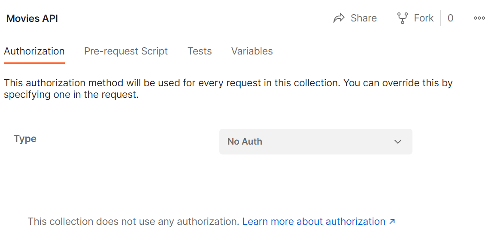
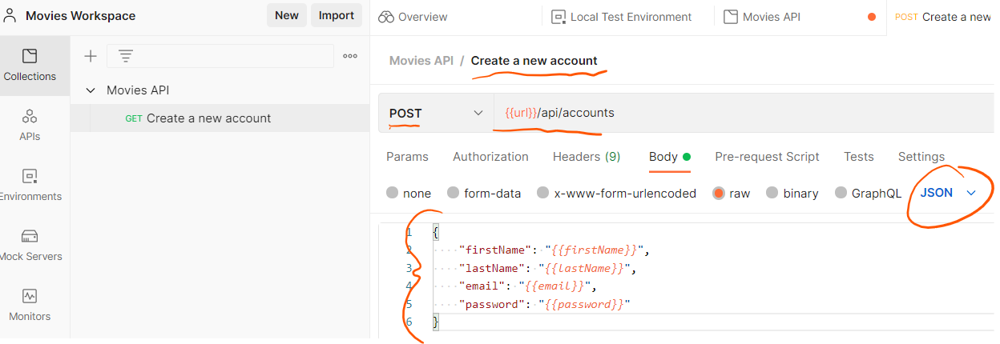
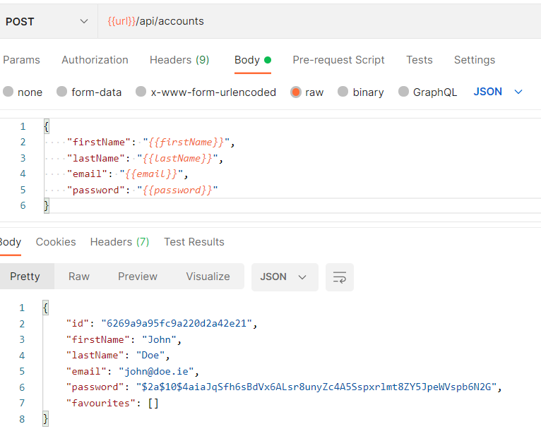
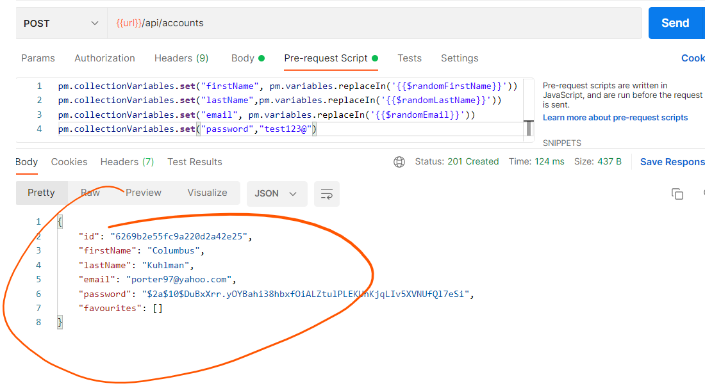
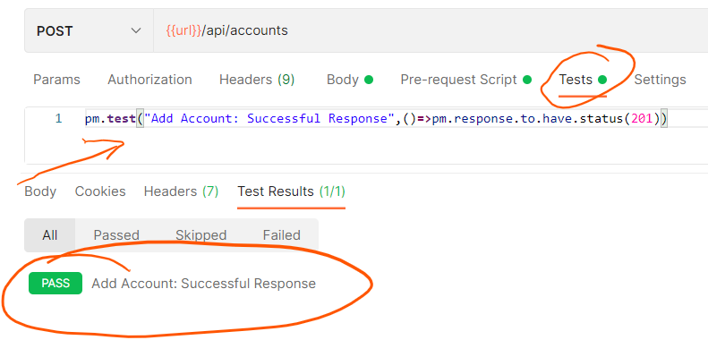
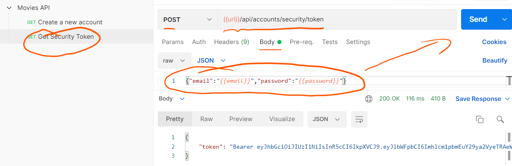
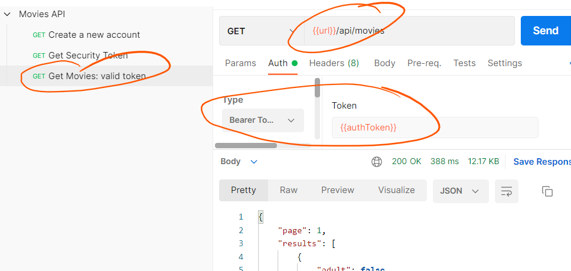
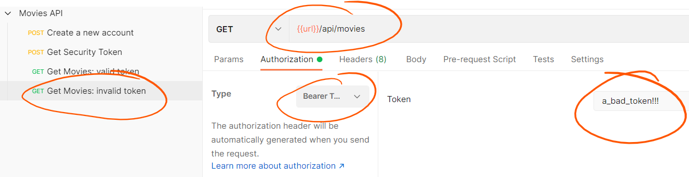

# Individual Tests

### Create a new workspace

+ Creating a Postman workspace will  help you organise your API testing

+ Open Postman app, select Workspaces from the Top menu and click the *creat Workspace* button. Enter the following details:

  

## Create a Development Environment

A Postman environment is a set of [variables](https://learning.postman.com/docs/sending-requests/variables/) you can use in your Postman requests. You can use environments to group values together. We will create a test environment to test the API:

+ Select  **Environments** on the left of the screen to access all environments. Select the + to add a new environment and enter the details as shown below:

  

+ Click the   button to make the configuration effective.

+ Select Local Test Environment and select the set active icon  to make an environment active. Select an environment to open it for editing in a tab.

## Create a Collection

+ Select  **Collections** on the left of the screen. Select the + to add a new collection and enter the details as shown below:



## Define Collection Variables

+ Select *Movies API* in collections. Then select the *Variables* tab and enter the following:
   
+ Click the   button to make the configuration effective.

## Add a "Create New Account" Request


+ Select the Movies API collection and select  *Add a request* 

+ Create a request to add an account by entering the following configuration values:

  

+ To send the request, make sure to start the API developed in the previous labs. Then click on **Send** in the postman request. You should see the following result:

  

+ Now hit the ***Send*** button again to send the same request. Notice that (as expected!) the response indicates duplicate key error:
  

  

To make testing of the API easier and repeatable, we can use a *Pre-request Script* to populate the collection variables with random data. Postman uses the [faker library](https://www.npmjs.com/package/@faker-js/faker) to generate sample data, including random names, addresses, email addresses. This way, we'll have a unique email address for each request. This allows you to generate "dynamic" data for your tests. 

+ Select the *Pre-request Script* tab and add the following Javascript code:

```json

pm.collectionVariables.set("firstName", pm.variables.replaceIn('{{$randomFirstName}}'))
pm.collectionVariables.set("lastName",pm.variables.replaceIn('{{$randomLastName}}'))
pm.collectionVariables.set("email", pm.variables.replaceIn('{{$randomEmail}}'))
pm.collectionVariables.set("password","test123@")
```

The *{{$randomEmail}}* gets a new random email using the faker library before each request. You can get more details [here](https://learning.postman.com/docs/writing-scripts/script-references/variables-list/) 

+ Now hit the ***Send*** button again. This time you should see a result similar to the following:

  

+ Click the   button to make the configuration effective.

## Write Tests 

You can write test scripts for your Postman API requests in JavaScript. You can add tests to individual requests in a collection. Postman also includes code snippets you add and then modify to suit your test logic.

Tests execute after the request finishes and the results are shown in the *Test Results* tab alongside the response data.

+ Open the "Create New Account" request and select the **Tests** tab. 

+ Enter the following test to check that the correct status code is returned:

  ~~~javascript
  pm.test("Add Account: Successful Response",()=>pm.response.to.have.status(201))
  ~~~

+ Hit ***send*** again and select the Test Results tab in the response section to check that the test passed:

  

By Using [ChaiJS BDD](https://www.chaijs.com/api/bdd/) syntax and `pm.expect` , we can also check details of the response. For example, creating an account should return a UUID for the account (remember this is generated by the Database).

+ Add another test to the script to check the response in more detail:

  ~~~javascript
  //... other tests
  const jsonData = pm.response.json();
  pm.test("Add Account: Response Object contains correct properties",()=>{
    pm.expect(jsonData).to.have.property("id");
    pm.expect(jsonData.id).to.be.a("string");
    pm.expect(jsonData.firstName).to.eql(pm.collectionVariables.get("firstName"));
    pm.expect(jsonData.lastName).to.eql(pm.collectionVariables.get("lastName"));
    pm.expect(jsonData.email).to.eql(pm.collectionVariables.get("email").toLowerCase());
  })
  ~~~

+ Run the test again by hitting the Send button. You should see the results for 2 tests:


+ Click the   button to save changes.

## Authentication Test

Once an account is added, you should be able to authenticate using the email and password. 

+ In the same collection, create a new test called ***Get Security Token*** with the configuration shown below:

  

When you click send, the request uses the collection variables generated in the previous "Add Account" request to get a JWT token (**NOTE:** this requires that you have executed the "Add Account" request )

+ Now lets write some tests that check the response is correct. Select the Tests tab and add the following tests: 

  ~~~javascript
  const jsonData = pm.response.json();
  
  pm.test("Get Token: Successful Response",()=>pm.response.to.have.status(200))
  
  pm.test("Get Token: Response Object contains token",()=>{
    pm.expect(jsonData).to.have.property("token");
    pm.expect(jsonData.token).to.be.a("string");
  })
  pm.test("Get Token: Response contains correctly formatted token",()=>{
    const splitArray = jsonData.token.split(" ")
    pm.expect(splitArray[0].toLowerCase()).to.eql("bearer");
    pm.expect(splitArray[1]).length.to.be.greaterThan(25);
    pm.collectionVariables.set("authToken",splitArray[1])
  })
  ~~~

  There are 3 tests here: Test HTTP response is successful, Test the response contains a token, Test the token is formatted correctly. 
  Also, notice that we create and set the ***authToken*** collection variable with the token returned in the response. This allows us to use the valid token in other tests, for example getting a list of movies.

+ Click the   button to save changes.

  ## Get Movies Request

  As you know, you should only be able to get a list of movies if you have a valid JWT token. We will now write 2 requests to check the protected endpoint *GET /api/movies.* One request will check the response using an invalid token. The second request will check using a valid token

  ### Valid Token Request

+ Create a new request in the same collection called ***Get Movies: valid token***. Configure to use Bearer Token authentication as shown below :

  

   

+ Open the Tests tab and add the following tests to check for a correct response: 

~~~javascript
pm.test("Get Movies: Status code is 200",  ()=> {
    pm.response.to.have.status(200);
});

pm.test("Get Movies: Content-Type is correct", function () {
   pm.expect(pm.response.headers.get('Content-Type')).to.contain('application/json');
});

pm.test("Get Movies: Response time is less than 400ms", () => {
  pm.expect(pm.response.responseTime).to.be.below(400);
});

const jsonData = pm.response.json();

pm.test("Get Movies: Test movie data of response", () => {
  pm.expect(jsonData).to.be.an("object");
  pm.expect(jsonData.page).to.be.a("number");
  pm.expect(jsonData.results).to.be.an("array").length.lessThan(21);
  aMovie=jsonData.results[0]
  pm.expect(aMovie).to.have.property("id");
  pm.expect(aMovie).to.have.property("title");
});
~~~

Run the script and you should see all tests passing

+ Click the   button to save changes.

### Invalid Token Request

+ Create a new request in the same collection called ***Get Movies: invalid token***. Configure to use a bad Bearer Token authentication as shown below :



+ Add the following tests:

  ~~~javascript
   var jsonData = pm.response.json();
  
  pm.test("Invalid Token: Correct Response", function () {
     pm.expect(pm.response.code).to.be.oneOf([500,401,403]);
     pm.expect(jsonData).to.be.an("object");
     pm.expect(jsonData).to.have.property("error");
  });
  ~~~

  Send this request and check that the above test passes.

+ Click the   button to save changes.

