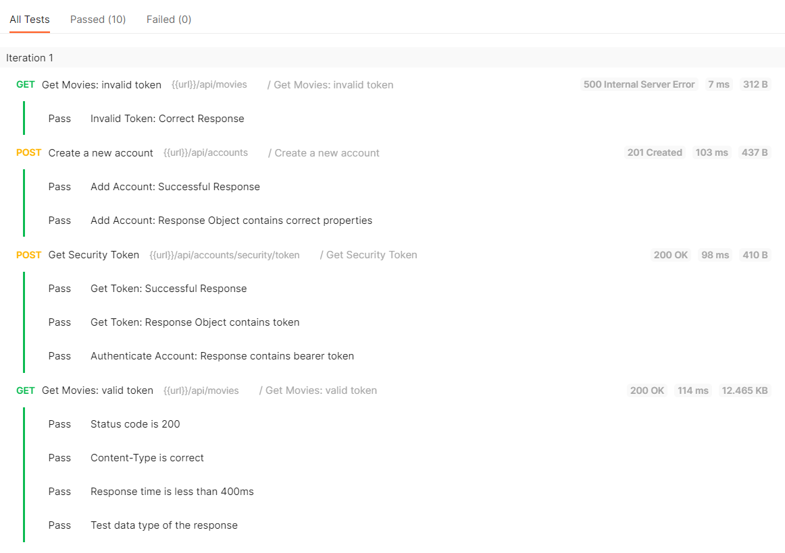
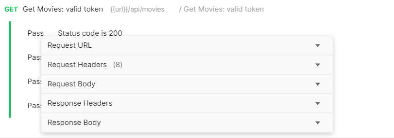
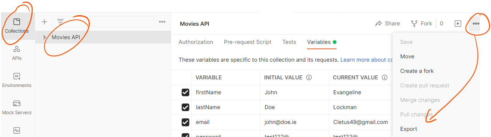
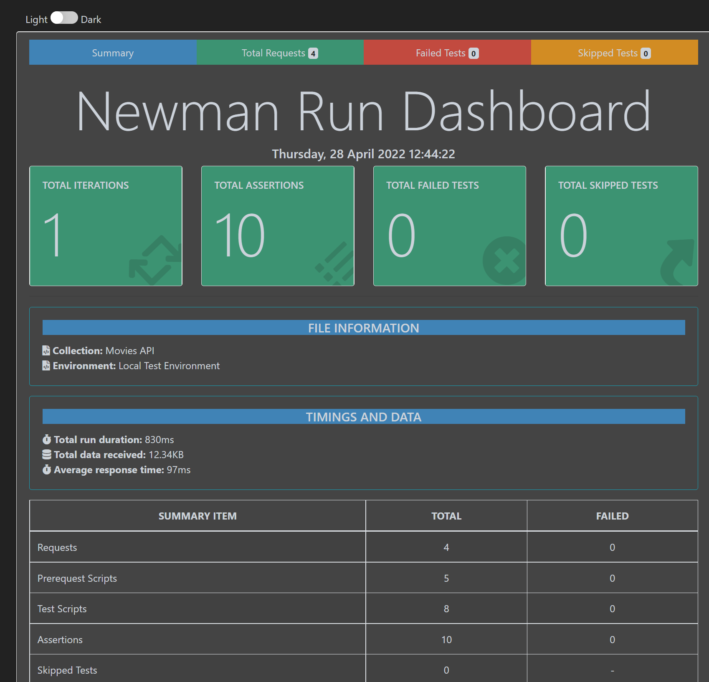

# Collection Runner & Automation

The *Collection Runner* enables you to run all the API requests in a collection in a specified sequence. Usin gthe collectin runner enables us to log test results and pass data between requests.

+ Select the Movies API collection and click on  Run to open the Collection Runner view

+ We will configure the collection runner to run the requests in the following order

  1. Get Movies using invalid token
  2. Create new account
  3. Get security token
  4. Get movies using security token

  Drag the *gGet movies: invlid toke* request to the top of the run order as shown in the configuration below:

+ Click on **Run Movies API**. You should see the request executions and test results.  

  

  ou will see whether each request passed or failed. You can also filter on each using the **Passed** and **Failed** tabs at the top. If any tests in a request script fail during the collection run, the whole request fails.

+ Click the "Get Movies: valid token" test from the list of results to get a more detail:

## Automating Collection Runs in VS Code

You can use collection runs  with [Newman](https://learning.postman.com/docs/running-collections/using-newman-cli/command-line-integration-with-newman/), the Postman command-line interface, enables you to run collections and build them into your development cycle. This will allow you to execute the requests and tests from within VS Code. To do this, we need to export our environment and collection from Postman as json files.

+ In your Movies API project, in the root folder create a new folder called **tests**

+ In the tests folder, create another folder called **reports**.

  

### Export Environment 

+ Select  **Environments** on the left of the screen. Select the environment you created earlier, click on the ... icon and select export and save into the *tests* folder created in the last step using file name **movies_environment.json**.

  

## Export Collection

+ Select  **Collections** on the left of the screen. Select the collection you created earlier, click on the ... icon and select export. 

+ Save as collection2.1  into the *tests* folder using file name **movies_collection.json**.

  

  ## Newman Automation

You have already installed Newman and the html report generation packages(if not, go back to Set Up step)

+ In your Movies API project, open **package.json** . Locates the *scripts* property and add the following test script shown below:

  ~~~json
   "scripts": {
      "start": "nodemon --exec babel-node index.js",
      "test": "newman run ./tests/movies_collection.json -e ./tests/movies_environment.json --reporters htmlextra,cli --reporter-htmlextra-export ./tests/reports/report.html"
    },
  ~~~

  The options specified in the run script are: 

  ​	

  | option                                                   | description                                                  |
  | -------------------------------------------------------- | ------------------------------------------------------------ |
  | ./tests/movies_collection.json                           | path to exported Postman Collection file                     |
  | -e ./tests/movies_environment.json                       | path to exported Postman Environment file                    |
  | --reporters htmlextra,cli                                | specifies how output will be reported, in this case command line(cli) and html(htmlextra) |
  | --reporter-htmlextra-export ./tests/reports/report.html" | specifies the path where the htmlextra report will be created |

+ Open a command line in the root folder of your movies api and execute the following:

  ~~~bash
  npm run test
  ~~~

  This will run the tests and output the results to the command line:

  

+ Check in the /tests/reports folder and open the report.html file in a browser. You should see the test report in html. Click on the Requests tab to get more detail for each request and test.
  

